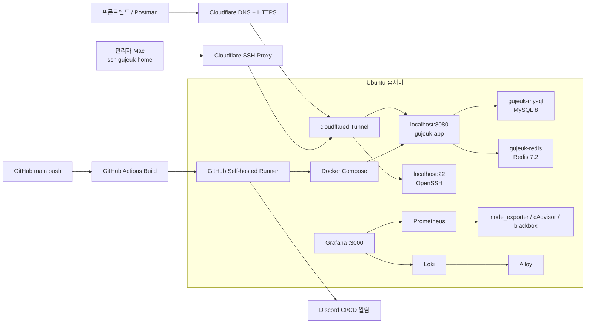
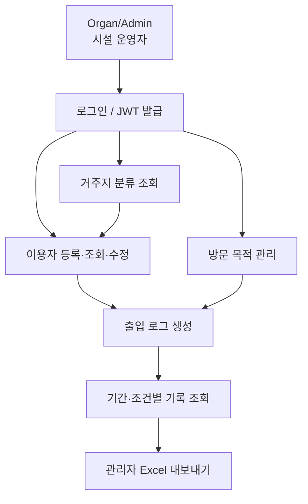
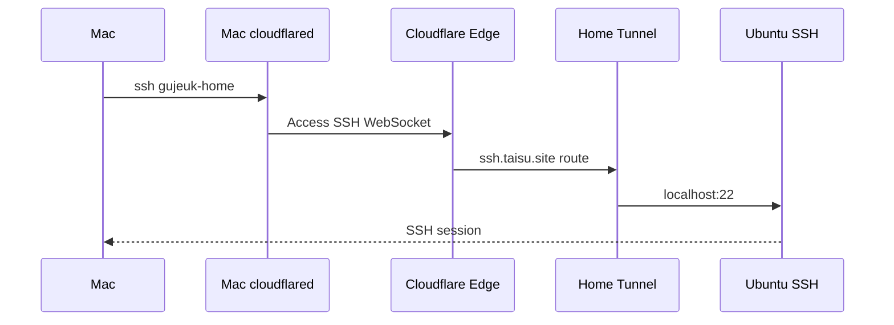
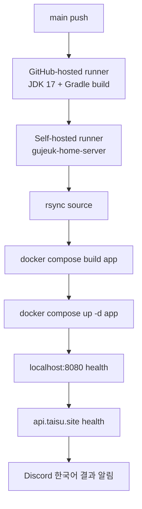

# 구즉 홈서버 구축·배포·운영 문서

> 기준일: 2026-06-09
> 대상 저장소: `GuJeuk-Check-in/GuJeuk-Check-In_server`
> 홈서버: Samsung 550XED / Ubuntu Server / 사용자 `ubuntu`

이 문서는 구즉 출입관리 백엔드를 개인 노트북 기반 Ubuntu 홈서버에 배포하면서 진행한 작업을 핵심 키워드별로 정리한다. 현재 사용 중인 구성뿐 아니라 장애 원인, 실패한 실험, 사용 금지 기능과 후속 과제도 함께 기록한다.

## 1. 전체 요약

### 핵심 키워드

- `Ubuntu Home Server`
- `Docker`
- `Docker Compose`
- `Spring Boot`
- `MySQL`
- `Redis`
- `Cloudflare Tunnel`
- `GitHub Actions`
- `Self-hosted Runner`
- `Discord Webhook`
- `Cron Watchdog`
- `Grafana`
- `Prometheus`
- `Loki`
- `Grafana Alloy`
- `node_exporter`
- `cAdvisor`
- `blackbox_exporter`
- `Database Restore`
- `CORS`
- `Remote SSH`

### 최종 운영 구조



### 주요 주소

| 구분 | 주소 | 내부 연결 |
|---|---|---|
| 운영 API | `https://api.taisu.site` | `http://localhost:8080` |
| 스테이징 API 라우트 | `https://api-stag.taisu.site` | `http://localhost:8081` |
| Focus Mate | `https://focus.taisu.site` | `http://localhost:8787` |
| GuJeuk Prototype | `https://prototype.taisu.site` | `http://localhost:8788` |
| 통합 모니터링 | `https://monitor.taisu.site` | `http://localhost:3000` |
| 원격 SSH | `ssh.taisu.site` | `ssh://localhost:22` |

### 중요 상태

- 운영 API는 Docker Compose 단일 스택으로 구성되어 있다.
- HTTPS는 Nginx나 Certbot이 아니라 Cloudflare가 외부 구간에서 처리한다.
- `main` 브랜치 push 시 홈서버에 자동 배포한다.
- `develop` 브랜치는 저장소 기본 브랜치이며 별도의 과거 CI/CD 구조를 가지고 있다.
- Wi-Fi 자동 변경 기능은 Netplan 충돌 사고가 있어 **현재 사용 금지**다.
- `rtcwake -m off` 예약 자동 부팅은 Samsung 550XED에서 실제 복귀에 실패했다. **현재 사용 금지**다.
- `rtcwake -m mem`의 `deep` 모드는 정상 resume 대신 콜드 부팅이 발생했다. **현재 사용 금지**다.
- 예약 복귀는 실제 검증된 `rtcwake -m freeze` 방식으로 동작한다.
- 완전 종료된 서버를 외부 소프트웨어만으로 다시 켤 수는 없다.

2026-06-09 KST 확인 시 운영 API, Cloudflare SSH와 통합 모니터링은 정상이다. 모니터링 스택의 내부 endpoint, Prometheus target과 HTTP probe, 사용자 정의 메트릭, Loki 로그 수집이 모두 검증됐다.

---

## 2. 홈서버 기본 구성

### 서버 경로

| 용도 | 경로 |
|---|---|
| 배포 코드 | `/home/ubuntu/git/gujeuk-check-in-server` |
| 통합 모니터링 | `/home/ubuntu/git/monitoring` |
| 운영 명령 스크립트 | `/home/ubuntu/bin` |
| GitHub Runner | `/home/ubuntu/actions-runner/gujeuk-check-in-server` |
| Cloudflare 설정 | `/home/ubuntu/.cloudflared` |
| 모니터 상태 | `/home/ubuntu/.config/gujeuk-monitor` |
| DB 백업 | `/home/ubuntu/git/gujeuk-check-in-server/backups` |

초기에는 코드가 `/home/ubuntu/gujeuk-check-in-server`에 있었으나, 디렉터리 구조를 정리하면서 `/home/ubuntu/git/gujeuk-check-in-server`로 이동했다. 이전 경로는 제거했다.

### 덮개 닫힘 동작

노트북 덮개를 닫아도 절전되지 않도록 `systemd-logind` 설정을 변경했다.

적용한 핵심 설정:

```ini
HandleLidSwitch=ignore
HandleLidSwitchExternalPower=ignore
HandleLidSwitchDocked=ignore
```

운영 조건:

- 충전기 연결 유지
- 인터넷 연결 유지
- 노트북 전원이 완전히 종료되지 않아야 함

### 재부팅 후 자동 복구

- Docker 컨테이너: `restart: unless-stopped`
- Cloudflare Tunnel: `@reboot` + 1분 watchdog
- GitHub Runner: `@reboot` + 1분 watchdog
- 서버 시작 Discord 알림: `@reboot`

운영 중 확인된 cron 구성:

```cron
@reboot /home/ubuntu/bin/start-cloudflared.sh >/home/ubuntu/.cloudflared/reboot-start.out 2>&1
* * * * * /home/ubuntu/bin/watch-cloudflared.sh >/home/ubuntu/.cloudflared/watchdog.out 2>&1

@reboot /home/ubuntu/bin/start-gujeuk-runner.sh >/home/ubuntu/actions-runner/gujeuk-check-in-server/reboot-start.out 2>&1
* * * * * /home/ubuntu/bin/watch-gujeuk-runner.sh >/home/ubuntu/actions-runner/gujeuk-check-in-server/watchdog.out 2>&1

*/5 * * * * /home/ubuntu/bin/monitor-gujeuk-api >/home/ubuntu/.config/gujeuk-monitor/monitor.out 2>&1
@reboot /home/ubuntu/bin/notify-server-started >/home/ubuntu/.config/gujeuk-monitor/startup-notify.out 2>&1
```

### 형상관리 범위

현재 홈서버 구성에는 Git으로 관리되는 파일과 서버에만 존재하는 파일이 섞여 있다.

Git으로 관리:

- `Dockerfile`
- `docker-compose.yml`
- `.github/workflows/ci-cd.yml`
- `ops/home-server/start-cloudflared.sh`
- `ops/home-server/watch-cloudflared.sh`
- Wi-Fi 실험 스크립트
- RTC 종료 실험 스크립트

서버에만 존재하는 런타임 스크립트:

- `cloudflared-supervisor.sh`
- `discord-notify`
- `monitor-gujeuk-api`
- `monitor-status`
- `notify-server-started`
- `runner-status`
- `server-battery`
- `server-command-list`
- `server-spec`
- `server-test`
- `start-gujeuk-runner.sh`
- `watch-gujeuk-runner.sh`

문제점:

- 서버 디스크가 손상되면 런타임 스크립트를 재구성하기 어려움
- 저장소 코드와 실제 서버 설정 사이에 drift가 발생할 수 있음
- 새 서버로 이전할 때 수동 작업이 많음

권장:

- 서버 전용 스크립트를 `ops/home-server`로 이전
- cron, sudoers, logind, cloudflared ingress의 설치 스크립트 작성
- 최종적으로 Ansible 또는 단일 bootstrap script로 재현 가능하게 구성

---

## 3. Docker 기반 애플리케이션 배포

### Dockerfile

`Dockerfile`은 멀티 스테이지 빌드를 사용한다.

1. `gradle:8.14.3-jdk17`
2. Gradle 의존성 캐시
3. `bootJar` 생성
4. `eclipse-temurin:17-jre` 런타임 이미지
5. `JAVA_OPTS`를 적용해 Spring Boot 실행

핵심 실행 방식:

```dockerfile
ENTRYPOINT ["sh", "-c", "exec java $JAVA_OPTS -jar app.jar"]
```

메모리 제한 예시:

```env
JAVA_OPTS=-Xms64m -Xmx128m
```

### Docker Compose 서비스

#### `app`

- 컨테이너: `gujeuk-app`
- 이미지: `gujeuk-check-in-server:latest`
- 외부 포트: 기본 `8080`
- MySQL과 Redis의 health check 통과 후 시작
- Spring Boot 환경 변수 주입

#### `mysql`

- 컨테이너: `gujeuk-mysql`
- 이미지: `mysql:8.0`
- 문자셋: `utf8mb4`
- collation: `utf8mb4_unicode_ci`
- 타임존: `Asia/Seoul`
- 데이터 볼륨: `mysql_data`

#### `redis`

- 컨테이너: `gujeuk-redis`
- 이미지: `redis:7.2-alpine`
- AOF 영속화: `appendonly yes`
- 데이터 볼륨: `redis_data`

### 주요 명령

```bash
cd /home/ubuntu/git/gujeuk-check-in-server

docker compose ps
docker compose up -d
docker compose build app
docker compose up -d app
docker compose logs --tail=200 app
```

### 환경 변수

실제 값은 서버의 `.env`에 저장하고 Git에는 포함하지 않는다.

| 변수 | 역할 |
|---|---|
| `DB_URL` | Spring JDBC 연결 주소 |
| `MYSQL_DATABASE` | MySQL 데이터베이스명 |
| `MYSQL_USER` | 애플리케이션 DB 계정 |
| `MYSQL_PASSWORD` | 애플리케이션 DB 비밀번호 |
| `MYSQL_ROOT_PASSWORD` | MySQL root 비밀번호 |
| `JWT_SECRET_KEY` | JWT 서명 키 |
| `REDIS_HOST` | Redis 호스트 |
| `REDIS_PORT` | Redis 포트 |
| `PROD_BASE_URL` | 운영 프론트엔드 CORS origin |
| `STAG_BASE_URL` | 개발/스테이징 프론트엔드 CORS origin |
| `VERCEL_URL` | 배포 프론트엔드 CORS origin |
| `TEST_URL` | 로컬 개발 CORS origin 목록 |
| `JAVA_OPTS` | JVM 메모리 옵션 |
| `APP_PORT` | 호스트에 노출할 애플리케이션 포트 |

CI/CD의 `rsync`는 `.env`를 제외하여 서버의 운영 비밀 값이 삭제되지 않도록 구성했다.

---

## 4. 데이터베이스 이전과 복원

### 수행 작업

1. 기존 운영 환경 DB dump 확보
2. 홈서버 MySQL 컨테이너에 복원
3. 새 동기화 dump로 다시 덮어쓰기
4. 복원 전 기존 DB를 gzip 백업
5. 애플리케이션 재시작 및 API 검증
6. 테스트 데이터 `test5` 관련 사용자·로그 삭제

### 최종 동기화에 사용한 dump

```text
projectsilmoo_gujeuk_prod_synced_20260603_153552.sql.zip
```

복원 전 생성한 서버 백업 예시:

```text
/home/ubuntu/git/gujeuk-check-in-server/backups/
gujeuk_prod_before_new_dump_20260603_123210.sql.gz
```

### 복원 직후 확인한 데이터 건수

> 아래 수치는 2026-06-03 복원 직후 기준이며 현재 값과 다를 수 있다.

| 테이블 | 건수 |
|---|---:|
| `admin` | 1 |
| `organ` | 5 |
| `purpose` | 12 |
| `residence` | 13 |
| `user` | 533 |
| `log` | 3293 |

### 안전한 백업 명령 예시

```bash
cd /home/ubuntu/git/gujeuk-check-in-server

docker compose exec -T mysql sh -c \
  'exec mysqldump -uroot -p"$MYSQL_ROOT_PASSWORD" \
  --single-transaction "$MYSQL_DATABASE"' \
  | gzip > backups/gujeuk_prod_$(date +%Y%m%d_%H%M%S).sql.gz
```

### dump 복원 명령 예시

```bash
unzip -p /path/to/dump.sql.zip '*.sql' \
  | docker compose exec -T mysql sh -c \
    'exec mysql -uroot -p"$MYSQL_ROOT_PASSWORD" "$MYSQL_DATABASE"'
```

중요:

- 입력 파이프를 사용할 때 `docker compose exec -T`를 사용한다.
- `-T`가 없으면 SSH 또는 Docker TTY가 표준 입력을 가로채 복원이 멈출 수 있다.
- 복원 전에 반드시 기존 DB 백업을 만든다.
- 복원 중에는 앱 쓰기를 중지하는 것이 안전하다.

### DB 직접 접속

```bash
cd /home/ubuntu/git/gujeuk-check-in-server
docker compose exec mysql mysql -uprod -p gujeuk_prod
```

root 접속:

```bash
docker compose exec mysql mysql -uroot -p gujeuk_prod
```

---

## 5. CORS와 애플리케이션 보안

### CORS 구조

Spring Security의 `CorsConfigurationSource`가 다음 환경 변수를 읽는다.

- `PROD_BASE_URL`
- `STAG_BASE_URL`
- `VERCEL_URL`
- `TEST_URL`

쉼표로 여러 origin을 전달할 수 있으며, 후행 `/`는 코드에서 제거한다.

허용한 로컬 및 배포 origin 예시:

```text
http://localhost:5173
http://localhost:5174
https://gujeuk-check-in-fe.pages.dev
```

허용 메서드:

```text
OPTIONS, GET, POST, PUT, PATCH, DELETE
```

자격 증명:

```java
configuration.setAllowCredentials(true);
```

### 인증 구조

- JWT Bearer 인증
- Redis 기반 토큰 저장
- 세션: `STATELESS`
- 비밀번호 암호화: BCrypt

공개 엔드포인트 예시:

```text
/user/sign-up
/user/login
/organ/create
/organ/login
/purpose/all
/residence/all
/organ/excel/user
```

### 서비스 API 흐름

구즉 백엔드는 시설 운영자를 기준으로 데이터를 분리하는 멀티 테넌트 형태다.



주요 API 영역:

| 영역 | 역할 |
|---|---|
| `/organ/**`, `/admin/**` | 운영자 계정, 로그인, 관리 기능 |
| `/user/**` | 이용자 등록, 로그인, 프로필 |
| `/purpose/**` | 방문 목적 조회와 관리 |
| `/residence/**` | 거주지 분류 조회 |
| `/log/**` | 출입 기록 생성, 조회, 수정 |

운영 상태 확인에는 인증 없이 호출 가능한 다음 API를 사용했다.

```text
GET /purpose/all
GET /residence/all
```

---

## 6. Cloudflare Tunnel, DNS, HTTPS

### 도입 이유

홈서버는 가정·학교·핫스팟 네트워크에 따라 사설 IP와 공인 IP가 변경될 수 있다. 공유기 포트포워딩과 고정 공인 IP 없이 서비스를 외부에 공개하기 위해 Cloudflare Tunnel을 사용했다.

Cloudflare Tunnel은 홈서버에서 Cloudflare로 outbound 연결을 생성하므로:

- 공유기 포트포워딩 불필요
- 공인 IP 변경에 영향이 적음
- 외부 80/443 포트 개방 불필요
- Cloudflare가 HTTPS 인증서를 처리

### Cloudflare ingress

홈서버의 `/home/ubuntu/.cloudflared/config.yml`에는 다음 구조를 적용했다.

```yaml
ingress:
  - hostname: api.taisu.site
    service: http://localhost:8080
  - hostname: api-stag.taisu.site
    service: http://localhost:8081
  - hostname: focus.taisu.site
    service: http://localhost:8787
  - hostname: prototype.taisu.site
    service: http://localhost:8788
  - hostname: monitor.taisu.site
    service: http://localhost:3000
  - hostname: ssh.taisu.site
    service: ssh://localhost:22
  - service: http_status:404
```

터널 ID와 credentials 파일은 민감정보이므로 문서에 기록하지 않는다.

### DNS 이전 과정

초기에는 가비아 DNS의 A 레코드에 당시 공인 IP를 직접 연결하는 방식을 검토했다. 그러나 홈 네트워크나 핫스팟이 바뀌면 공인 IP도 변경될 수 있어 운영 방식으로 부적합했다.

최종적으로:

1. 가비아에서 구매한 `taisu.site`의 네임서버를 Cloudflare 네임서버로 변경
2. Cloudflare에서 Tunnel 생성
3. `api`, `api-stag`, `focus`, `prototype`, `monitor`, `ssh` hostname을 Tunnel route로 연결
4. 공인 IP 직접 A 레코드 의존 제거

현재 Tunnel은 로컬 설정 파일로 관리된다. Cloudflare 대시보드에 `locally managed`로 표시되는 경우 route를 대시보드에서 수정할 수 없으며 홈서버의 `config.yml`과 `cloudflared tunnel route dns` 명령으로 관리한다.

### Nginx와 Certbot을 사용하지 않은 이유

현재 구조에서는 Cloudflare가 외부 HTTPS를 종료하고 Tunnel을 통해 HTTP origin으로 전달한다.

따라서 현재 요구사항에는 다음 구성이 필수가 아니다.

- Nginx reverse proxy
- Let's Encrypt
- Certbot
- 공유기 80/443 포트포워딩

Nginx가 필요한 경우:

- 서버 내부에서 여러 앱을 경로 기반으로 라우팅
- Cloudflare 없이 직접 HTTPS 서비스
- 정적 파일 캐시, 세밀한 프록시 설정 필요

### 장애 코드 해석

| 코드 | 의미 | 우선 확인 |
|---|---|---|
| `200` | API 정상 | 없음 |
| `502` | Tunnel은 연결됐지만 origin API가 응답하지 않음 | `gujeuk-app`, `localhost:8080` |
| `530 / 1033` | Cloudflare가 활성 Tunnel connector를 찾지 못함 | `cloudflared` 프로세스와 인터넷 |
| `000` | curl이 HTTP 응답 자체를 받지 못함 | Wi-Fi, DNS, 인터넷, timeout |

`HTTP 000000`처럼 출력된 적이 있는데, 이는 일부 검사 스크립트가 curl의 `000`과 fallback 값을 중복 출력한 표시 문제였다.

### Cloudflare 자동 복구

`start-cloudflared.sh`:

- 중복 실행 방지용 `flock`
- supervisor와 tunnel 프로세스 확인
- 반쯤 죽은 상태 정리 후 supervisor 시작
- background 프로세스에 lock file descriptor가 상속되지 않도록 `9>&-` 적용

`watch-cloudflared.sh`:

- 프로세스 존재 여부 검사
- 로컬 API와 공개 API 분리 검사
- `530 / 1033` 감지 시 Tunnel 재시작
- 네트워크 fingerprint 변경 감지
- 반복 실패 횟수 저장

### CI/CD와 Tunnel 관련 장애

과거 CI/CD가 앱 재배포 순간의 일시적인 `502`를 Tunnel 장애로 오판해 cloudflared를 재시작했다.

그 결과:

1. 앱 컨테이너 교체 중 `502`
2. CI/CD가 cloudflared 종료
3. GitHub Runner job 종료 시 자식 프로세스 정리
4. `530 / 1033` 발생
5. API와 Cloudflare SSH 동시 단절

해결:

- CI/CD에서 Cloudflare Tunnel 재시작 단계를 제거
- 배포는 앱 컨테이너만 교체
- Tunnel 복구는 독립 watchdog이 담당

---

## 7. Cloudflare SSH

### Mac SSH 설정

`~/.ssh/config`:

```sshconfig
Host gujeuk-home
  HostName ssh.taisu.site
  User ubuntu
  ProxyCommand cloudflared access ssh --hostname %h
```

접속:

```bash
ssh gujeuk-home
```

`gujeuk-home`은 Mac의 SSH alias이므로 홈서버 내부에서 다시 `ssh gujeuk-home`을 입력하는 용도가 아니다.

### 동작 원리



### 주의사항

- 홈서버가 꺼져 있으면 접속할 수 없다.
- 홈서버 인터넷이 끊기면 접속할 수 없다.
- cloudflared가 죽으면 `websocket: bad handshake`가 발생할 수 있다.
- `ssh.service`가 inactive라도 `ssh.socket` 기반 socket activation이면 SSH가 동작할 수 있다.

동일 LAN에서 Cloudflare가 끊겼을 때:

```bash
ssh ubuntu@<현재-LAN-IP>
```

단, LAN IP는 네트워크가 바뀌면 변경된다.

---

## 8. CI/CD

### 운영 브랜치 `main`

현재 `main`의 `.github/workflows/ci-cd.yml`은 다음 흐름이다.



세부 단계:

1. `ubuntu-latest`에서 checkout
2. JDK 17 설정
3. `./gradlew clean build -x test`
4. 홈서버 self-hosted runner에서 checkout
5. 배포 디렉터리에 `rsync`
6. `.env`, 백업, import 파일 보존
7. 운영 스크립트 설치
8. 앱 이미지 빌드
9. 앱 컨테이너 교체
10. 로컬 API 확인
11. 공개 API 확인
12. 사용하지 않는 Docker 이미지 정리
13. Discord 결과 알림

### GitHub Self-hosted Runner

Runner label:

```text
gujeuk-home-server
```

경로:

```text
/home/ubuntu/actions-runner/gujeuk-check-in-server
```

관련 명령:

```bash
runner-status
/home/ubuntu/bin/start-gujeuk-runner.sh
/home/ubuntu/bin/stop-gujeuk-runner.sh
```

### Discord CI/CD 메시지

구분:

- `구즉 CI/CD 커밋 반영 완료`
- `긴급: 구즉 CI 빌드 실패`
- `긴급: 구즉 CI/CD 커밋 반영 실패`
- `구즉 CI 검사 완료 / 배포 대상 아님`

포함 정보:

- 브랜치
- 커밋 SHA
- 실행자
- 빌드 결과
- 배포 결과
- 저장소
- Actions 실행 URL

### `develop` 브랜치와의 차이

저장소 기본 브랜치는 현재 `develop`이다.

`origin/develop`에는 다음과 같은 별도 구조가 남아 있다.

- Docker Hub 이미지 push
- `main`은 EC2 운영 배포
- `develop`은 홈서버 `8081` 스테이징 배포
- `docker-compose.stag.yml` 사용

반면 현재 홈서버 운영에 사용한 최신 인프라 작업은 `main`에 존재한다.

이 상태의 문제:

- 브랜치별 CI/CD 정책이 다름
- 같은 저장소에서 운영 기준이 두 개로 갈림
- GitHub 잔디는 기본 브랜치인 `develop` 기준으로 집계되어 `main` 직접 커밋이 바로 표시되지 않을 수 있음

권장:

1. 기본 브랜치를 `main`으로 통일하거나
2. `main`의 운영 변경사항을 `develop`에 병합하고
3. prod/stag 배포 정책을 하나의 workflow로 재설계

---

## 9. Discord 운영 알림과 모니터링

### 알림 종류

- 서버 부팅
- 정상 종료
- API 장애
- API 정상 복구
- 배터리 10% 이하
- 배터리 상태 복구
- CI 빌드 성공/실패
- 홈서버 배포 성공/실패

Discord Webhook은 메시지 발송만 지원한다. Discord 채팅에서 `/status` 같은 명령을 받아 처리하려면 별도의 Discord Bot과 외부에서 항상 실행되는 bot process가 필요하며 현재는 구현하지 않았다.

### API 모니터

`monitor-gujeuk-api`가 다음 항목을 확인한다.

- `gujeuk-app`
- `gujeuk-mysql`
- `gujeuk-redis`
- `http://localhost:8080/purpose/all`
- `https://api.taisu.site/purpose/all`
- 배터리 잔량과 충전 상태

5분마다 검사하지만 정상 메시지를 반복 전송하지 않는다.

상태 전이가 있을 때만 알림:

- 정상 → 장애
- 장애 → 복구
- 배터리 정상 → 10% 이하
- 배터리 부족 → 복구

### Grafana 통합 모니터링

별도 프로젝트 경로:

```text
/home/ubuntu/git/monitoring
```

구성:

| 도구 | 수집·제공 항목 |
|---|---|
| Grafana | 웹 대시보드, 로그 검색, 활성 경보 |
| Prometheus | 15초 단위 메트릭 저장과 경보 평가 |
| node_exporter | 호스트 CPU, 메모리, 디스크, 네트워크 |
| cAdvisor | 컨테이너별 CPU, 메모리, 네트워크 |
| blackbox_exporter | 로컬 서비스와 공개 HTTPS URL probe |
| Loki | 로그 저장과 LogQL 검색 |
| Alloy | Docker socket과 systemd journal 로그 전송 |
| home-metrics | 배터리, AC, 컨테이너와 Compose 프로젝트 상태 |

기본 대시보드:

- `홈서버 전체 현황`
- `프로젝트와 컨테이너`
- `통합 로그와 컨테이너`

컨테이너 상세 표시:

- 실행 또는 중지 상태
- Docker Healthcheck
- 누적 재시작 횟수
- 컨테이너별 현재 CPU
- 컨테이너별 현재 메모리
- 프로젝트와 컨테이너 필터
- Docker 로그와 systemd journal

로그 검색 변수는 정규식 raw 값으로 Loki에 전달한다. `${search:regex}`를 사용하면 기본값 `.*`가 문자 그대로 이스케이프되어 `No data`가 발생하므로 사용하지 않는다.

점검 대상:

- 운영 API: 로컬 컨테이너와 `https://api.taisu.site`
- 스테이징 API: 로컬 컨테이너와 `https://api-stag.taisu.site`
- Focus Mate: 로컬 컨테이너와 `https://focus.taisu.site`
- GuJeuk Prototype: 로컬 컨테이너와 `https://prototype.taisu.site`
- Grafana: 로컬 endpoint와 `https://monitor.taisu.site`

보관 정책:

- Prometheus: 기본 30일 또는 8GB 중 먼저 도달한 한도
- Loki: 기본 14일
- Grafana 설정과 수집 데이터: Docker named volume

보안:

- Grafana만 Cloudflare Tunnel로 외부 공개
- Grafana 익명 접근과 회원가입 비활성화
- Prometheus, Loki, Alloy는 `127.0.0.1`에만 바인딩
- `.env`의 Grafana credential은 권한 `600`으로 관리
- Docker socket 마운트는 호스트 제어 권한에 준하므로 신뢰하는 이미지에만 허용

배포와 검증:

```bash
cd /home/ubuntu/git/monitoring
docker compose up -d
./scripts/verify.sh
```

전체 검증은 다음을 확인한다.

- Compose와 Prometheus·Alloy 설정 문법
- Grafana, Prometheus, Loki, Alloy readiness
- Prometheus scrape target
- 모든 로컬·공개 HTTP probe
- 배터리와 Docker 사용자 정의 메트릭
- Loki 라벨과 로그 수집

2026-06-09 실제 확인 결과:

- 모니터링 컨테이너 8개 실행
- 모든 HTTP probe 성공
- 배터리와 AC 상태 수집
- Docker 및 journal 로그 조회
- Grafana의 Prometheus와 Loki datasource health 정상

한계:

- 이 스택도 홈서버에서 실행되므로 홈서버 완전 종료나 전체 인터넷 단절을 외부로 알릴 수 없다.
- 완전한 외부 장애 감지는 별도 SaaS 또는 클라우드 실행 monitor가 필요하다.

### 중요한 한계

홈서버 자체가 완전히 꺼지거나 인터넷이 끊기면:

- Discord로 메시지를 보낼 수 없음
- SSH도 끊김
- 로컬 모니터도 실행되지 않음

즉, 진짜 외부 장애 감지를 위해서는 홈서버 외부의 모니터가 필요하다.

권장 후보:

- UptimeRobot
- Better Stack
- Cloudflare Health Checks
- 별도 클라우드 서버의 cron
- GitHub-hosted scheduled workflow

---

## 10. 운영 명령어

### 상태 점검

```bash
health
```

또는:

```bash
/home/ubuntu/bin/health
```

출력 예시:

```text
app          정상 실행 중
mysql        정상 healthy
redis        정상 healthy
local-api    정상 HTTP 200
public-api   정상 HTTP 200
상태: 정상
```

`test`도 같은 용도로 만들었으나 Bash builtin 이름과 충돌할 수 있어 `health` 사용을 권장한다.

### 기타 명령

| 명령 | 역할 |
|---|---|
| `commands` | 사용자 명령 목록 |
| `battery` | 배터리 잔량 |
| `spec` | CPU, RAM, GPU, 디스크 요약 |
| `health` | 컨테이너와 API 점검 |
| `monitor-status` | Discord 모니터 상태 |
| `runner-status` | GitHub Runner 상태 |
| `shutdown` | 예약 절전 또는 완전 종료 명령 |

통합 모니터링 확인:

```bash
cd /home/ubuntu/git/monitoring
./scripts/verify.sh
docker compose ps
docker compose logs --tail=200 grafana prometheus loki alloy
```

### Slash command

편의를 위해 루트 경로에 다음 심볼릭 링크를 설치하는 스크립트를 만들었다.

```text
/command
/battery
/spec
/shutdown
/test
/wifi
```

설치 스크립트:

```bash
sudo /home/ubuntu/bin/install-slash-commands.sh
```

일반 명령인 `commands`, `battery`, `spec`, `health` 사용을 우선 권장한다.

### 한글 콘솔 시도

Ubuntu CLI에서 한글 메시지가 깨지는 문제를 해결하기 위해 다음을 시도했다.

- 한국어 locale 설치
- 콘솔 한글 폰트와 환경 설정
- `korean-console` 진입

콘솔 화면이 멈추거나 글자가 안정적으로 표시되지 않아 최종적으로:

- 서버 CLI 명령 출력은 영어로 유지
- Discord 운영 알림만 한국어 사용
- 시스템 locale은 영어 기반으로 복원

즉, 서버 관리 명령은 `battery: 85%`와 같은 단순 영어 출력을 사용한다.

### 배터리 직접 확인

```bash
cat /sys/class/power_supply/BAT1/capacity
```

### 서버 사양 확인

```bash
spec
```

### 현재 Wi-Fi 확인

커스텀 `wifi` 명령 대신 Ubuntu 기본 명령을 사용한다.

```bash
iw dev wlo1 link | grep SSID
```

상세 확인:

```bash
networkctl status wlo1 --no-pager
```

IP 확인:

```bash
hostname -I
```

---

## 11. Wi-Fi 변경 실험과 장애

### 목표

다음 기능을 제공하는 `wifi` 명령을 만들었다.

- 주변 Wi-Fi 목록 조회
- 번호 선택
- 비밀번호 입력
- Netplan 저장
- 재부팅 후 자동 연결

### 사용 기술

- `iw`
- `wpa_cli`
- `wpa_supplicant`
- Netplan
- 제한된 sudo helper
- `/etc/sudoers.d/gujeuk-wifi`

### 발생한 문제

홈서버는 `NetworkManager`가 아니라 다음 구조였다.

- `systemd-networkd`
- Netplan
- `wpa_supplicant`

추가 생성한 `/etc/netplan/99-gujeuk-wifi.yaml`이 기존 `/etc/netplan/00-installer-config.yaml`과 충돌했다.

결과:

- iPhone 핫스팟에 잠깐 연결
- 기존 Wi-Fi로 즉시 복귀
- DHCP 주소 변경
- cloudflared 연결 고착
- API `530 / 1033`
- Cloudflare SSH 단절

복구:

```bash
sudo rm -f /etc/netplan/99-gujeuk-wifi.yaml
sudo netplan generate
sudo netplan apply
```

### 현재 결론

`ops/home-server/server-wifi`와 관련 installer는 저장소에 실험 기록으로 남아 있지만:

- 현재 CI/CD에서는 설치하지 않음
- 운영 환경에서 사용하지 말 것
- `wifi` 명령으로 원격 네트워크를 바꾸지 말 것

안전한 대안:

- 서버 화면에서 직접 Wi-Fi 변경
- NetworkManager로 네트워크 관리 체계를 전환한 뒤 `nmcli` 사용
- 유선 LAN 사용
- USB Ethernet 사용

핫스팟 연결 시 iPhone에서 다음 조건이 필요하다.

- 개인용 핫스팟 활성화
- 다른 사람의 연결 허용
- 필요 시 호환성 최대화
- 핫스팟 설정 화면을 열어 SSID 검색 가능 상태 유지

---

## 12. 전원 관리

### 가능한 작업

원격 재부팅:

```bash
ssh gujeuk-home 'sudo reboot'
```

원격 종료:

```bash
ssh gujeuk-home 'sudo shutdown -h now'
```

### 완전 종료 후 원격 부팅

완전히 꺼진 서버에서는 다음 프로그램이 모두 실행되지 않는다.

- SSH
- cloudflared
- Docker
- GitHub Runner
- Discord 알림

따라서 외부 소프트웨어만으로 원하는 순간 다시 켤 수 없다.

필요한 하드웨어 또는 펌웨어 기능:

- BIOS `Power on AC`
- Wake-on-LAN + 유선 LAN
- 스마트 플러그
- 원격 전원 버튼 장치

### RTC 예약 복귀

처음에는 `rtcwake -m off -s <seconds>` 기반 예약 종료 명령을 구현했다.

예상 사용 방식:

```text
shutdown
Hours: 0.5
Continue: yes
```

예약 종료 Discord 메시지까지 정상 전송됐지만 Samsung 550XED에서 실제 자동 부팅에 실패했다.

확인 결과:

- 예약 부팅 시간 경과
- API `530`
- Cloudflare SSH 불가
- LAN IP 응답 없음

결론:

- 이 장비에서 `rtcwake -m off` 완전 종료 복귀는 검증 실패
- 커널은 RTC가 S4까지 깨울 수 있다고 보고하며 S5 기상을 보장하지 않음
- `rtcwake -m mem` + `deep`은 예약 기상 시 정상 resume 대신 콜드 부팅 발생
- 최종적으로 `rtcwake -m freeze`를 적용
- 60초 테스트에서 Boot ID 유지, `PM: suspend entry (s2idle)`와 `PM: suspend exit` 확인
- 공개 API는 복귀 후 약 29초 내 HTTP 200 복구

현재 `shutdown` 동작:

- Hours `0`보다 큰 값: 저전력 `freeze` 절전 후 예약 복귀
- Hours `0`: 완전 종료, 자동 복귀 없음
- 절전 중 API와 SSH는 중단됨
- 복귀 후 Cloudflare Tunnel 재연결에 수십 초가 걸릴 수 있음
- 예약 절전 작업은 검증된 `nohup` 분리 프로세스로 실행되어 SSH 세션 종료와 무관하게 동작
- 복귀 후 `notify-server-resumed`가 local/public API를 최대 5분간 확인
- API 상태와 서버·Wi-Fi·배터리 정보를 포함한 Discord 복귀 완료 알림 전송

복귀 알림 테스트:

```bash
/home/ubuntu/bin/notify-server-resumed --test
```

---

## 13. 장애 사례와 해결 기록

### 사례 A: Wi-Fi 변경 후 API `530`

증상:

- 로컬 API 정상
- Docker 정상
- 공개 API `530 / 1033`
- `ssh gujeuk-home`에서 WebSocket handshake 실패

원인:

- 네트워크 변경 후 기존 cloudflared 연결이 정상적으로 재수립되지 않음
- supervisor/tunnel 프로세스가 반쯤 살아 있는 상태
- start lock file descriptor가 background supervisor에 상속되어 재시작 차단

해결:

- cloudflared 강제 종료 후 supervisor 재시작
- `nohup "$SUPERVISOR" 9>&-`로 lock descriptor 상속 차단
- watchdog에서 `530 / 1033` 감지

### 사례 B: CI/CD 배포 직후 `530`

증상:

- 앱 교체 순간 `502`
- 이후 `530`
- SSH도 단절

원인:

- 배포 workflow가 일시적인 `502`를 Tunnel 장애로 오판
- CI job 내부에서 시작한 cloudflared가 job 종료 시 정리됨

해결:

- CI/CD의 Tunnel 재시작 단계 삭제
- 앱과 Tunnel 생명주기 분리

### 사례 C: `HTTP 000000`

가능 원인:

- Wi-Fi 미연결
- DNS 실패
- 인터넷 미연결
- curl timeout
- 검사 출력 중복

확인 순서:

```bash
ping -c 3 8.8.8.8
ping -c 3 cloudflare.com
curl -I http://localhost:8080/purpose/all
curl -I https://api.taisu.site/purpose/all
```

### 사례 D: RTC 예약 부팅 실패

증상:

- 정상 종료 알림 전송
- 예약 시각 이후에도 서버 응답 없음

원인:

- OS에서는 RTC alarm 설정이 가능했으나 펌웨어가 S5 완전 종료 복귀를 수행하지 않음
- 커널 로그가 `rtc_cmos: RTC can wake from S4`로 이 장비의 RTC 기상 한계를 표시
- `deep` 절전은 ACPI resume 문제로 콜드 부팅 발생

교훈:

- `rtcwake --dry-run` 성공은 실제 전원 복귀 성공을 보장하지 않음
- 전원 관련 기능은 짧은 실제 테스트 후 운영에 사용해야 함
- 이 장비에서는 검증된 `freeze` 모드만 예약 복귀에 사용

---

## 14. 장애 대응 Runbook

### API가 안 될 때

외부:

```bash
curl -I https://api.taisu.site/purpose/all
```

SSH 가능 시:

```bash
ssh gujeuk-home
health
```

Docker 확인:

```bash
cd /home/ubuntu/git/gujeuk-check-in-server
docker compose ps
docker compose logs --tail=200 app
```

로컬 API:

```bash
curl -I http://localhost:8080/purpose/all
```

### `502`일 때

```bash
cd /home/ubuntu/git/gujeuk-check-in-server
docker compose ps
docker compose logs --tail=200 app
docker compose up -d app
```

### `530 / 1033`일 때

```bash
pgrep -af cloudflared
/home/ubuntu/bin/start-cloudflared.sh
tail -n 100 /home/ubuntu/.cloudflared/cloudflared.log
tail -n 100 /home/ubuntu/.cloudflared/watchdog.log
```

필요한 경우:

```bash
pkill cloudflared
sleep 2
/home/ubuntu/bin/start-cloudflared.sh
```

### SSH도 안 될 때

1. 공개 API의 HTTP 코드 확인
2. 같은 LAN이면 현재 서버 IP로 직접 SSH
3. 서버 화면에서 인터넷 연결 확인
4. 서버 화면에서 cloudflared 재시작
5. 완전 종료 상태면 물리적으로 전원 켜기

---

## 15. 보안 관리

### 절대 Git에 저장하지 않을 값

- MySQL 비밀번호
- MySQL root 비밀번호
- JWT secret
- Discord webhook URL
- Cloudflare tunnel credentials
- GitHub Runner 등록 token
- SSH private key

### 노출 이력에 대한 조치

구축 과정의 채팅과 터미널 입력에서 다음 값이 노출된 이력이 있다.

- JWT secret
- GitHub Runner 등록 token
- Discord webhook URL
- DB 관련 비밀 값

추가로 저장소가 추적 중인 다음 파일에서 실제 운영 secret 형태의 값이 확인됐다.

```text
backups/prod-2026-06-02/gujeuk-check-in-server.prod.env
```

이 파일에는 최소한 JWT secret과 DB credential 항목이 포함되어 있으므로 **즉시 조치가 필요하다.**

권장 조치:

1. 해당 백업 `.env` 파일을 Git 추적에서 제거
2. `backups/**/*.env`를 `.gitignore`에 추가
3. Git 기록에서 secret을 제거하거나 저장소 이력을 재작성
4. Discord webhook 재발급
5. JWT secret 교체
6. DB 비밀번호 교체
7. GitHub Runner 등록 token은 만료 여부와 관계없이 재발급 정책 확인
8. Cloudflare credentials 파일 권한 `600` 유지
9. 서버 `.env` 권한 `600` 적용

```bash
chmod 600 /home/ubuntu/git/gujeuk-check-in-server/.env
chmod 600 /home/ubuntu/.cloudflared/*.json
chmod 600 /home/ubuntu/.config/gujeuk-monitor/discord-webhook-url
```

---

## 16. 현재 한계와 후속 과제

### 우선순위 높음

1. **외부 모니터 도입**
   - 홈서버가 완전히 꺼져도 장애를 감지할 수 있어야 함

2. **전원 복구 방식 확정**
   - 현재 예약 복귀는 `freeze` 모드로 운영
   - 완전 종료 복구가 필요하면 BIOS AC 자동 부팅 확인
   - 유선 Wake-on-LAN 검토
   - 하드웨어 사용이 불가하면 예약 작업에서 완전 종료하지 않기

3. **Wi-Fi 운영 정책 확정**
   - 운영 중 원격 Wi-Fi 변경 금지
   - 가능하면 유선 LAN 사용

4. **브랜치와 CI/CD 통합**
   - 기본 브랜치 `develop`과 운영 브랜치 `main`의 정책 통일
   - prod/stag workflow 통합

5. **정기 DB 백업 자동화**
   - 일 단위 dump
   - 보존 기간
   - 외부 저장소 복제
   - 정기 복원 테스트

### 코드 품질

- CI에서 현재 테스트를 `-x test`로 제외하고 있음
- 테스트 환경 DB와 Redis 구성 후 테스트 활성화 필요
- `spring.jpa.hibernate.ddl-auto=update`는 운영 스키마 관리에 위험할 수 있음
- Flyway를 비활성화한 상태이므로 migration 체계 도입 필요
- 로그 레벨은 운영 환경에서 최소화 필요

### 스테이징

- Cloudflare의 `api-stag.taisu.site -> localhost:8081` 라우트는 존재한다.
- `develop` 브랜치에는 홈서버 스테이징 배포 workflow가 존재한다.
- 현재 `main`의 Compose는 운영 단일 스택이다.
- 실제 스테이징 상태는 브랜치와 secret을 통합한 후 재검증해야 한다.

---

## 17. 주요 작업 타임라인

| 커밋 | 작업 |
|---|---|
| `3dd6f86` | 홈서버 CI/CD 구성 |
| `b47ba90` | Discord CI 알림 추가 |
| `626bd48` | Discord 알림 한국어화 |
| `04ad579` | 커밋 반영 성공/실패 알림 구체화 |
| `74bedf4` | Wi-Fi 선택 명령 실험 |
| `6e7f6d7` | 홈서버 스크립트 실행 권한 반영 |
| `cdef71c` | 네트워크 변경 후 Tunnel 복구 개선 |
| `7aff5fa` | 핫스팟 변경 후 서버 복구 배포 |
| `d2f690b` | RTC 예약 종료 기능 추가 |
| `8622df7` | 배포 중 Tunnel을 유지하도록 수정 |
| `196a006` | 예약 종료 Discord 문구 개선 |

---

## 18. 운영 원칙

1. 운영 중 Wi-Fi를 원격으로 바꾸지 않는다.
2. 완전 종료 후 RTC 자동 부팅 기능을 사용하지 않는다.
3. 예약 복귀는 검증된 `freeze` 모드만 사용한다.
4. 서버를 완전히 끄기보다 `reboot` 또는 예약 절전을 우선 사용한다.
5. 배포 중 Tunnel 프로세스를 직접 조작하지 않는다.
6. DB 복원 전 반드시 백업한다.
7. 비밀 값은 Git과 문서에 남기지 않는다.
8. `health` 결과에서 local/public을 구분해 판단한다.
9. `502`, `530`, `000`을 같은 장애로 취급하지 않는다.
10. 홈서버 외부에서 별도 uptime monitoring을 운영한다.
11. 운영 브랜치와 기본 브랜치를 하나로 통일한다.

---

## 19. 2026-06-10 운영 회원가입·로그인 장애 진단

### 재현 결과

| 대상 | 결과 |
|---|---|
| `GET https://api.taisu.site/purpose/all` | HTTP 200 |
| `GET https://api.taisu.site/residence/all` | HTTP 200 |
| 빈 `POST /user/sign-up` | 수정 전 HTTP 500, 수정 후 HTTP 400 |
| 잘못된 성별 `MALE` 회원가입 | 수정 전 HTTP 500, 수정 후 HTTP 400 |
| 존재하지 않는 사용자 `POST /user/login` | HTTP 404 |
| `https://gujeuk.dsmhs.kr` | 점검 시 HTTP 503 |
| Pages 배포본 `/` | React Router route 부재로 흰 화면 |

회원가입의 성별 값은 `MALE`, `FEMALE`이 아니라 `MAN`, `WOMAN`이다.

### 확인된 원인

1. `spring-boot-starter-validation`이 `compileOnly`여서 운영 JAR에 validation 구현체가 포함되지 않았다.
2. `maleCount`, `femaleCount`, `privacyAgreed`가 primitive 타입이라 `@NotNull`이 동작하지 않았다.
3. 잘못된 enum JSON이 공통 500 처리로 들어갔다.
4. 같은 사용자의 `user_id + visit_date + visit_time`은 유일해야 하지만 시간 정밀도가 분 단위여서 같은 분 재요청이 DB 500으로 노출됐다.
5. 운영 프론트 도메인이 정상 호스팅되지 않고 있다.
6. Pages에 배포된 프론트는 관리자용이며 사용자 회원가입·로그인 UI와 API 호출 코드가 없다.

### 적용한 조치

- validation 의존성을 runtime JAR에 포함
- 회원가입·로그인 동행인 수를 nullable wrapper와 0 이상 제약으로 변경
- 회원가입 개인정보 동의를 필수화
- 이름·전화번호 길이와 생년월일 형식 검증 추가
- 읽을 수 없는 JSON과 잘못된 날짜를 HTTP 400으로 처리
- 같은 분 중복 체크인을 HTTP 409 `DUPLICATE_LOG`로 처리
- Docker build에서 Gradle wrapper를 다시 다운로드하지 않고 빌드 이미지의 Gradle을 사용
- 홈서버에서 앱 이미지를 재빌드하고 `gujeuk-app`을 재배포

### 남은 작업

- 사용자 체크인 전용 프론트 구현 또는 올바른 저장소·빌드 복구
- `https://gujeuk.dsmhs.kr` DNS와 실제 호스팅 대상 복구
- 프론트 `/` route 또는 시작 redirect 추가
- 프론트 요청의 성별 enum을 `MAN`, `WOMAN`으로 통일
